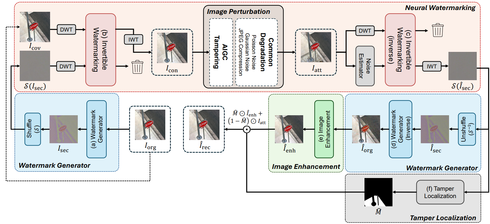

<br><br>

# <p align="center">Robust Image Self-Recovery against Tampering using Watermark Generation with Pixel Shuffling</p>

<p align="center">
  <a href="https://arxiv.org/abs/2511.22936">arXiv</a> | <a href="https://eurominyoung186.github.io/ReImage/">Project</a>
</p>

<p align="center">
  by <a href="https://github.com/EuroMinyoung186">Minyoung Kim</a>,
  <a href="https://phseo.github.io/">Paul Hongsuck Seo</a>
</p>

## Introduction
The rapid growth of Artificial Intelligence-Generated Content (AIGC) raises concerns about the authenticity of digital media. In this context, image self-recovery—reconstructing original content from its manipulated version—offers a practical solution for understanding the attacker's intent and restoring trustworthy data. However, existing methods often fail to accurately recover tampered regions, falling short of the primary goal of self-recovery.

To address this challenge, we propose **ReImage**, a neural watermarking-based self-recovery framework that embeds a shuffled version of the target image into itself as a watermark. We design a generator that produces watermarks optimized for neural watermarking and introduce an image enhancement module to refine the recovered image. We further analyze and resolve key limitations of shuffled watermarking, enabling its effective use in self-recovery.

This is our official implementation of ReImage!



ReImage embeds an invisible, shuffled watermark into an image through an invertible neural network (INN). After the image has been edited or tampered (e.g., inpainting, face swap, Photoshop-style edits), ReImage localizes the tampered region and recovers the original content, achieving state-of-the-art performance across diverse tampering scenarios.

For further details, please check out our [Paper](https://arxiv.org/abs/2511.22936) and our [Project](https://eurominyoung186.github.io/ReImage/) page.

## Installation
```bash
pip install -r requirements.txt
```

Notes:
- Python ≥ 3.10 and a CUDA GPU are required (`nccl`/`cuda` calls are unconditional).
- `basicsr` is imported by the INN architecture modules; `pip install basicsr` is sufficient (no compilation of the DCN ops is needed for the default config).
- Training/testing logs metrics to [Weights & Biases](https://wandb.ai). Run `wandb login` first, or disable it with:

  ```bash
  export WANDB_MODE=offline   # or WANDB_MODE=disabled
  ```

## Repository Structure

```
├── train2.py                  # Training entry point
├── test2.py                   # Evaluation: tamper localization + recovery
├── options/
│   ├── options.py             # YAML config parser
│   ├── train/train_shuffle.yml
│   └── test/test.yml
├── models/                    # Model, losses, INN architecture, metrics
├── data/                      # Dataset loaders (file-list based)
├── noise/                     # Differentiable attack layers (Gaussian noise, JPEG, blur)
└── utils/                     # Logging and image I/O helpers
```

## Data Preparation

- **Training**: we train on [COCO 2017](https://cocodataset.org/) (`train2017`). Download it from the official website.
- **Test (original images & masks)**: we use the tampering benchmark released by [EditGuard](https://github.com/xuanyuzhang21/EditGuard). Download the original images and edit-region masks from [🔗 this link](https://drive.google.com/file/d/1s3HKFOzLokVplXV65Z6xcsBJ9qI91Qfv/view?usp=sharing).
- **Test (edited images)**: we inpaint the masked regions with Stable Diffusion and SDXL. Download our pre-generated edited sets from [🔗 Google Drive](https://drive.google.com/drive/folders/1vXGYU3vbHK_l7XLUBYiOYopflObzyrHb), or generate them yourself:

  ```bash
  pip install diffusers transformers accelerate

  python scripts/generate_edited.py --model sd \
      --img_dir /path/to/test_img --mask_dir /path/to/test_mask --out_dir /path/to/sd_edited

  python scripts/generate_edited.py --model sdxl \
      --img_dir /path/to/test_img --mask_dir /path/to/test_mask --out_dir /path/to/sdxl_edited
  ```

All loaders read plain text files that list **absolute image paths, one per line**. Create a `datalists/` directory (or edit the paths in the YAML configs) with:

| File | Used by | Contents |
|---|---|---|
| `datalists/train.txt` | training | Training images (COCO `train2017`) |
| `datalists/test_img.txt` | test2.py | Original (cover) images |
| `datalists/test_mask.txt` | test2.py | Binary masks of the edited region |
| `datalists/test_edited.txt` | test2.py | Edited images (e.g. SD-inpainted, SimSwap output, Photoshop edits) |

The three lists of a split must be aligned line-by-line (i-th image ↔ i-th mask ↔ i-th edited image). Image size is controlled by `GT_size` in the YAML (256 for training crops, 512 for the test configs).

You can generate the lists with the provided script (files are sorted by name, so corresponding files should share the same filename across the three test directories):

```bash
# Training list (COCO train2017)
python scripts/make_datalists.py --train_dir /path/to/coco/train2017

# Test lists
python scripts/make_datalists.py \
    --test_img_dir /path/to/test/original \
    --test_mask_dir /path/to/test/mask \
    --test_edited_dir /path/to/test/edited
```

## Training
```bash
python train2.py -opt options/train/train_shuffle.yml
```

- Checkpoints and logs are written to `../experiments/invertible_pipeline/` (i.e. an `experiments/` directory **next to** the repository root):
  - `models/<iter>_G.pth` — network weights
  - `training_state/<iter>.state` — optimizer/scheduler state for resuming
- To resume, uncomment `resume_state` in the YAML and point it at a `.state` file.
- Key hyper-parameters (learning rate, iterations, loss weights, checkpoint frequency) are all in the YAML under `train:` and `logger:`.

#### Model Weights
| Model Weights | Link |
|--------------|------|
| ReImage (HuggingFace) | [🔗 Click here](https://huggingface.co/Eurong2/ReImage) |
| ReImage (Google Drive) | [🔗 Click here](https://drive.google.com/drive/folders/1GLF0IvavCmG-6I5zhGOCDi7oNzMgelTN) |

Or download directly with the HuggingFace CLI:

```bash
pip install -U huggingface_hub
hf download Eurong2/ReImage --local-dir ../experiments/invertible_pipeline
```

Then place the files as:

```
../experiments/invertible_pipeline/models/200000_G.pth
../experiments/invertible_pipeline/training_state/200000.state
```

## Inference
The test script loads the checkpoint through `path.resume_state` in its YAML config. By default it expects:

```
../experiments/invertible_pipeline/training_state/200000.state
../experiments/invertible_pipeline/models/200000_G.pth
```

Adjust `resume_state` (and the experiment `name`) in the YAML if your checkpoint lives elsewhere.

```bash
python test2.py -opt options/test/test.yml
```

The model embeds the watermark, localizes the tampered region itself, and recovers the original content. Outputs are saved to `./results/` (change with `--save_dir`), one subdirectory per stage, keeping the input filenames:

```
results/
├── GT/          # original images
├── WATERMARK/   # watermarked images
├── ATTACKED/    # tampered inputs
├── EXTRACT/     # extracted (shuffled) watermarks
├── UNSHUFFLE/   # unshuffled watermarks
└── RECOVER/     # final recovered images
```

Average metrics (PSNR / SSIM / LPIPS, mask AUC / IoU / F1, runtime) are printed at the end of the run.

## Notes
- GPU selection is done via `gpu_ids` in the YAML (exported as `CUDA_VISIBLE_DEVICES`).
- Multi-GPU (distributed) training is available through `--launcher pytorch` with `torchrun`; the default is single-GPU.
- Random seed is fixed with `--seed` (default 20).

## Acknowledgement
This project includes code from [LF-VSN]([https://github.com/ppp23/LF-VSN](https://github.com/MC-E/LF-VSN)) and [BasicSR](https://github.com/XPixelGroup/BasicSR).

## Citation
```BibTeX
@InProceedings{Kim_2026_CVPR,
    author    = {Kim, Minyoung and Seo, Paul Hongsuck},
    title     = {Robust Image Self-Recovery against Tampering using Watermark Generation with Pixel Shuffling},
    booktitle = {Proceedings of the IEEE/CVF Conference on Computer Vision and Pattern Recognition (CVPR) Findings},
    month     = {June},
    year      = {2026},
    pages     = {8877-8886}
}
```
